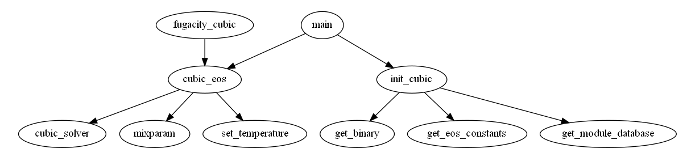

# README

# Cubic EoSs -  MATLAB implementation

## About the author:

Emanuel A. Crespo\
PhD in Chemical Engineering: 2017-2021\
University of Aveiro/CICECO Aveiro Institute of Materials

## Introduction:

This repository contains an implementation of the Peng-Robinson (PR) and Soave-Redlich-Kwong (SRK) cubic equations of state. It is based on the recommendations provided in Michelsen & Mollerups's book that I recommend to anyone interested in the efficient implementation of thermodynamic models.

**Thermodynamic Models: Fundamentals and Computational Aspects**\
Author(s) : Michael L. Michelsen & Jorgen Mollerup.\
ISBN : 87-989961-3-4\
Second edition 2007, 2nd printing 2018, Tie-Line Publications

## Examples:

The following example shows how to use this code to determine the natural logarithm of the fugacity coefficients and its first order derivatives in order to *T*, *P* or *x* that can then be used for different types of phase equilibrium calculations.

```matlab
NC=3;                   %Number of components
indexes=[1 14 15];      %Index of the mixture components in the compounds database
T=240;                  %Temperature (K)
P=5;                    %Pressure (MPa)
nfeed=[50 10 40];       %Feed (number of moles in the feed)
EoS=1;                  %EoS Model (0)SRK (1)Peng-Robinson
phasetype=1;            %Desired root: (1)Liquid (-1)Vapor (0)Minimum Gibbs energy
solvertype=1;           %Solver type: (1)Mollerup (2)Mollerups with root sort
%Convert the Feed into a normalized composition for n=1
zfeed=nfeed/sum(nfeed);
%Read the database and set up the correct cubic EoS
[SQTC,kij,delta1,delta2,bci,aci,mfunc]=init_cubic(NC,EoS,indexes);
%Carry the calculations
[phasefound,Z,fug,fugT,fugP,fugX,AUX]=cubic_eos(NC,T,P,zfeed,phasetype,solvertype,SQTC,kij,delta1,delta2,bci,aci,mfunc);
```

Additionally some other properties are provided in the AUX output, namely:

```matlab
AUX(1)=ZV2;   %Compressibility factor of the other root
AUX(2)=dG;    %Gibbs energy difference between the two roots
AUX(3)=HR;    %Residual Enthalpy
AUX(4)=SR;    %Residual Entropy
AUX(5)=CPR;   %Residual Heat Capacity
AUX(6)=dSdP;  %Derivative of entropy in order to pressure
AUX(7)=dHdP;  %Derivative of enthalpy in order to pressure
AUX(8)=DPDV*T;%Derivative of pressure in order to volume x T
AUX(9)=DVDT;  %Derivative of volume in order to temperature
AUX(10)=DPDV; %Derivative of pressure ir order to volume
```

## Organization of the code:

### get_module_database.m

This file is a small database containing the critical properties and binary interaction parameters required for calculations.

### get_eos_cosntants.m

Taking into account the cubic EoS selected (SRK or PR) this routines yields the necessary constants for the model.

### get_binary.m

Retrieves the binary interaction parameters matrix in the form (1-kij) for the components present in the mixture.

### init_cubic.m

This is a routine that initializes the EoS for the system under study and calculates everything that remains constant throughout the calculations, once the EoS model and system components are fixed.

### set_temperature.m

Calculates the temperature dependent part of the EoS.

### mixparam.m

Determines the A and B parameters for the mixture and the derivatives of A in order to temperature and composition.

### cubic_solver.m

This subroutines solves the cubic EoS for the compressibility factor.

### cubic_eos.m

Core routine for the calculations using the PR & SRK EoSs.

### Documentation folder:

In this folder further documentation for each routine is provided as long as cross-reference information and dependency graphs. This documentation was generated using the amazing `m2html` toolbox that can be found [here](https://www.artefact.tk/software/matlab/m2html/tutorial.php). The best way to check out this documentation is to download the documentation folder to your computer and open the index.html file in your browser!

## Code Dependency Graph:


